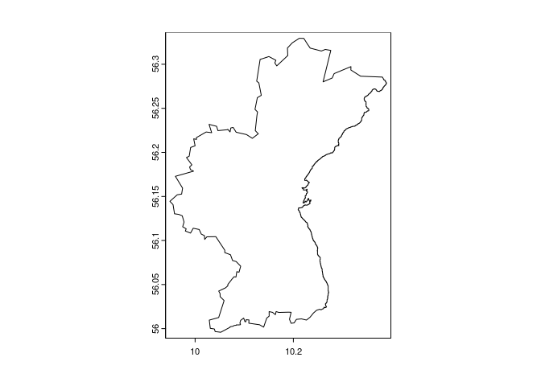
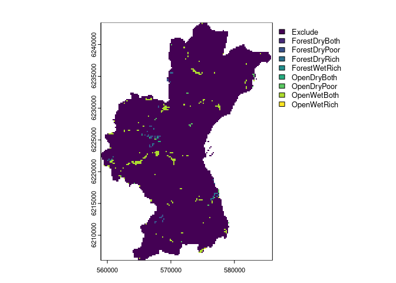
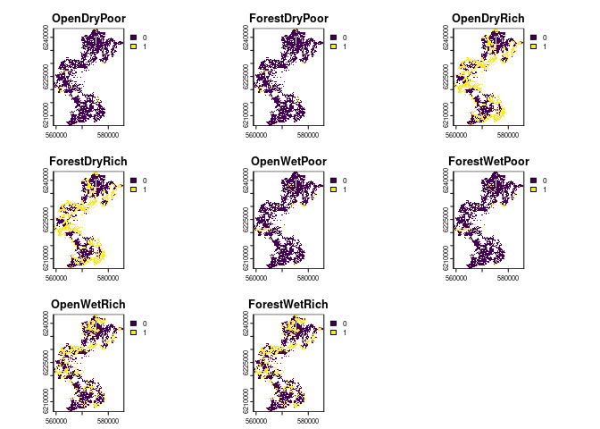
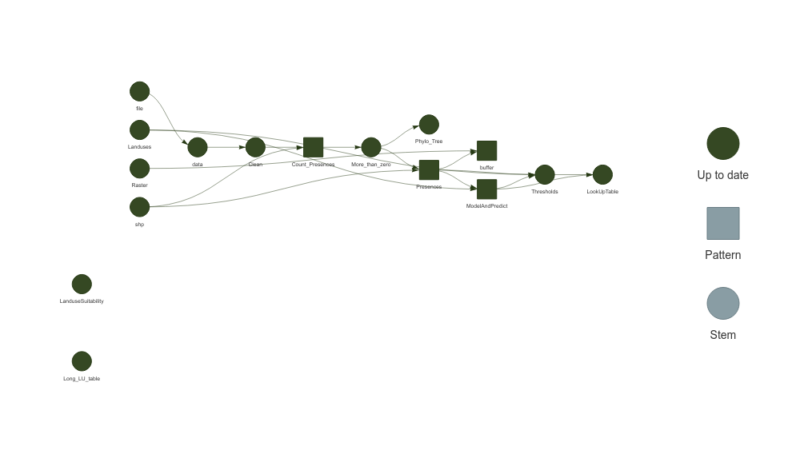

- [1 SpeciesPoolR](#1-speciespoolr)
- [2 Motivation for the pacakge](#2-motivation-for-the-pacakge)
  - [2.1 Rare species are common and
    important](#21-rare-species-are-common-and-important)
- [3 Required Data Files](#3-required-data-files)
  - [3.1 Species List File](#31-species-list-file)
  - [3.2 Shapefile](#32-shapefile)
  - [3.3 Raster Template File](#33-raster-template-file)
  - [3.4 Land-Use Raster File](#34-land-use-raster-file)
  - [3.5 Land-Use Suitability Raster
    File](#35-land-use-suitability-raster-file)
- [4 Using SpeciesPoolR Manually](#4-using-speciespoolr-manually)
  - [4.1 Importing and Downloading Species
    Presences](#41-importing-and-downloading-species-presences)
  - [4.2 Creating Spatial Buffers and Habitat
    Filtering](#42-creating-spatial-buffers-and-habitat-filtering)
  - [4.3 Generating summary biodiversity
    statistics](#43-generating-summary-biodiversity-statistics)
- [5 Running the SpeciesPoolR
  Workflow](#5-running-the-speciespoolr-workflow)
  - [5.1 How It Works](#51-how-it-works)
- [6 References](#6-references)

<!-- README.md is generated from README.Rmd. Please edit that file -->

# 1 SpeciesPoolR

<!-- badges: start -->

[](https://github.com/derek-corcoran-barrios/SpeciesPoolR/actions/workflows/R-CMD-check.yaml)

<!-- badges: end -->

The goal of the SpeciesPoolR package is to generate potential species
pools and their summary metrics in a spatial way. You can install the
package directly from GitHub:

``` r
#install.packages("remotes")
remotes::install_github("derek-corcoran-barrios/SpeciesPoolR")
```

No you can load the package

``` r
library(SpeciesPoolR)
```

# 2 Motivation for the pacakge

## 2.1 Rare species are common and important

In ecological research, the debate on whether rare species outnumber
common species within communities is pivotal for understanding
biodiversity and guiding conservation efforts. Numerous studies have
shown that rare species typically dominate large ecological assemblages,
although common species often exert a more substantial influence on
overall species richness patterns (Magurran and Henderson 2003;
Bregović, Fišer, and Zagmajster 2019; Schalkwyk, Pryke, and Samways
2019). This complexity underscores the need for innovative approaches in
studying biodiversity, particularly since rare species are challenging
to model using traditional Species Distribution Models (SDMs) due to
their low occurrence rates (Boyd et al. 2022).

Given the limitations of SDMs in capturing the dynamics of rare species,
it is essential to develop alternative methods for integrating these
species into biodiversity assessments and conservation planning.
Although rare species contribute uniquely to functional diversity and
ecosystem stability, especially in specific habitats (Chapman,
Tunnicliffe, and Bates 2018; Säterberg et al. 2019), their elusiveness
in ecological models presents a significant challenge. The question of
the minimum number of presence records required for reliable SDMs is
crucial. Research has shown that while as few as 10-15 presence
observations can produce nonrandom models for some species (Støa et al.
2019), others require higher thresholds—ranging from 14 to 25 records
depending on the species’ prevalence and geographic range (Proosdij et
al. 2016; Sampaio and Cavalcante 2023). These findings suggest that even
sparse datasets can be useful, but the threshold varies significantly
depending on species traits and habitat characteristics. Therefore,
researchers must explore novel analytical frameworks and conservation
strategies that better accommodate the ecological importance of rare
species, thereby enhancing our ability to manage and preserve
biodiversity effectively (Reddin, Bothwell, and Lennon 2015).

In highly degraded habitats, such as Denmark, where over 60% of the land
is dominated by agriculture and less than 10% remains as natural
habitat, traditional SDMs may face further limitations. The scarcity of
natural habitats means that presence records are often skewed towards
human-modified landscapes, complicating the modeling of species’
ecological preferences. In such contexts, where the majority of
occurrences may not reflect the species’ natural behaviors or habitat
use, relying on complex SDMs could lead to misleading predictions.
Instead, simpler algorithms that incorporate basic dispersal mechanisms
and habitat filtering might be more effective. By reducing assumptions
about habitat preferences, these methods can provide a more realistic
framework for conservation planning, particularly when dealing with the
restoration of agricultural lands into natural habitats.

For rare species, and indeed for many others, this approach may offer a
more practical solution in scenarios where detailed ecological data is
sparse or unreliable. Studies have suggested that in such landscapes,
simplistic models that prioritize dispersal and broad habitat
suitability over intricate ecological niches can better capture species’
potential distributions and their responses to environmental changes
(**GUISAN_2006?**; Thuiller et al. 2005), an example to this approach
would be range bagging (Drake 2015). This pragmatic approach is
especially pertinent when planning conservation actions in areas where
habitat degradation has left little intact nature, and it ensures that
even under data constraints, effective biodiversity management can still
be pursued.

# 3 Required Data Files

To effectively execute the `SpeciesPoolR` workflow, a set of essential
data files must be provided. These files contain the necessary spatial
and taxonomic information that underpin the various analytical steps in
the package. Below, we detail each required file and its role within the
workflow.

## 3.1 Species List File

- **File Type**: CSV or Excel file

- **Description**: The species list file serves as the foundational
  dataset, comprising the species of interest for your analysis. At a
  minimum, this file must include a column for the scientific names of
  species (`Species`). Additional taxonomic columns, such as `Kingdom`,
  `Class`, and `Family`, may also be included to facilitate filtering
  and subgroup analyses.

An example of this file is provided within the package and can be
accessed using the following code:

``` r
exampleSpecies <- system.file("ex/Species_List.csv", package="SpeciesPoolR")
print(exampleSpecies)
#> [1] "/home/au687614/R/x86_64-pc-linux-gnu-library/4.4/SpeciesPoolR/ex/Species_List.csv"
```

This dataset is further discussed in the section on [Reading and
Filtering Data](#411-step-1-reading-and-filtering-data), with a filtered
subset displayed in Table <a href="#tab:tablespecies">4.1</a>.

## 3.2 Shapefile

- **File Type**: Shapefile (.shp)

- **Description**: The shapefile delineates the geographic area of
  interest, which can range from a broad region, such as a country, to a
  more specific locality, such as a nature reserve. This file is
  utilized to spatially constrain species occurrences, ensuring that
  only those within the defined boundaries are included in the analysis.

If a shapefile is unavailable, a two-letter country code (e.g., “DK” for
Denmark) may be provided as an alternative to specify the area of
interest.

An example shapefile is included in the package and can be accessed as
follows:

``` r
shp <- system.file("ex/Aarhus.shp", package="SpeciesPoolR")
print(shp)
#> [1] "/home/au687614/R/x86_64-pc-linux-gnu-library/4.4/SpeciesPoolR/ex/Aarhus.shp"
```

The shapefile’s application is illustrated in the section on [Counting
Species Presences](#413-step-3-counting-species-presences), where it is
used to delineate the boundaries of Aarhus commune, as shown in Figure
<a href="#fig:plotshapefile">3.1</a>.

<div class="figure">



<p class="caption">

<span id="fig:plotshapefile"></span>Figure 3.1: Outline of the comune of
Aarhus

</p>

</div>

## 3.3 Raster Template File

- **File Type**: Raster file (e.g., .tif)

- **Description**: The raster template file is employed as a spatial
  reference for rasterizing species presence buffers. It must cover the
  entire area of interest and possess a resolution appropriate for the
  intended analysis. This template ensures consistent spatial alignment
  across all raster-based operations.

You can explore an example of this file using the following code:

``` r
template <- system.file("ex/LU_Aarhus.tif", package="SpeciesPoolR")
print(template)
#> [1] "/home/au687614/R/x86_64-pc-linux-gnu-library/4.4/SpeciesPoolR/ex/LU_Aarhus.tif"
```

The raster template’s role in buffer creation is further explained in
the section on [Creating Buffers Around Species
Presences](#421-step-1-creating-buffers-around-species-presences), with
an example shown in Figure <a href="#fig:plottemplate">3.2</a>.

<div class="figure">



<p class="caption">

<span id="fig:plottemplate"></span>Figure 3.2: Raster of the Aarhus
comune, the package will use Non NA cells as part of the template

</p>

</div>

## 3.4 Land-Use Raster File

- **File Type**: Raster file (e.g., .tif)

- **Description**: This file contains land-use classifications for the
  study area, where each raster cell is assigned to a specific land-use
  category (e.g., forest, wetland, urban). This data is crucial for
  modeling habitat suitability, enabling the filtering of species
  occurrences based on the prevalent land uses within their potential
  habitats.

An example file is provided in the package:

``` r
LU <- system.file("ex/LU_Aarhus.tif", package="SpeciesPoolR")
print(LU)
#> [1] "/home/au687614/R/x86_64-pc-linux-gnu-library/4.4/SpeciesPoolR/ex/LU_Aarhus.tif"
```

The land-use raster is identical to the template shown in Figure
<a href="#fig:plottemplate">3.2</a>.

## 3.5 Land-Use Suitability Raster File

- **File Type**: Raster file (e.g., .tif)

- **Description**: This file comprises binary suitability values for
  various land-use types within the study area, indicating whether each
  land-use type is suitable (value = 1) or unsuitable (value = 0) for
  the habitat of interest. The data is subsequently transformed into a
  long-format table, which is integral to the habitat filtering and
  species distribution modeling processes.

An example raster file is available in the package, and its application
is discussed in the section on [Preparing Land-Use
Data](#4221-preparing-land-use-data). A visualization of this file is
presented in Figure <a href="#fig:plotexampleLU">3.3</a>.

<div class="figure">



<p class="caption">

<span id="fig:plotexampleLU"></span>Figure 3.3: Landuse suitability for
8 different landuses in the aarhus commune

</p>

</div>

# 4 Using SpeciesPoolR Manually

## 4.1 Importing and Downloading Species Presences

### 4.1.1 Step 1: Reading and Filtering Data

If you are going to use each of the functions of the SpeciesPoolR
manually and sequentially, the first step would be to read in a species
list from either a CSV or an XLSX file. You can use the get_data
function for this. The function allows you to filter your data in a
dplyr-like style:

``` r
f <- system.file("ex/Species_List.csv", package="SpeciesPoolR")
filtered_data <- get_data(
   file = f,
   filter = quote(Kingdom == "Plantae" & 
                    Class == "Magnoliopsida" & 
                    Family == "Fabaceae")
)
```

This will generate a dataset that can be used subsequently to count
species presences and download species data as seen in table
<a href="#tab:tablespecies">4.1</a>

| redlist_2010 | Kingdom | Phyllum       | Class         | Order   | Family   | Genus     | Species               |
|:-------------|:--------|:--------------|:--------------|:--------|:---------|:----------|:----------------------|
| NA           | Plantae | Magnoliophyta | Magnoliopsida | Fabales | Fabaceae | Vicia     | Vicia sepium          |
| NA           | Plantae | Magnoliophyta | Magnoliopsida | Fabales | Fabaceae | Genista   | Genista tinctoria     |
| NA           | Plantae | Magnoliophyta | Magnoliopsida | Fabales | Fabaceae | Trifolium | Trifolium vesiculosum |
| LC           | Plantae | Magnoliophyta | Magnoliopsida | Fabales | Fabaceae | Vicia     | Vicia sativa          |
| NA           | Plantae | Magnoliophyta | Magnoliopsida | Fabales | Fabaceae | Lathyrus  | Lathyrus latifolius   |
| NA           | Plantae | Magnoliophyta | Magnoliopsida | Fabales | Fabaceae | Anthyllis | Anthyllis vulneraria  |
| NA           | Plantae | Magnoliophyta | Magnoliopsida | Fabales | Fabaceae | Vicia     | Vicia sepium          |
| NA           | Plantae | Magnoliophyta | Magnoliopsida | Fabales | Fabaceae | Lathyrus  | Lathyrus japonicus    |
| NA           | Plantae | Magnoliophyta | Magnoliopsida | Fabales | Fabaceae | Vicia     | Vicia villosa         |

<span id="tab:tablespecies"></span>Table 4.1: Species that will be used
to generate species pools

### 4.1.2 Step 2: Taxonomic Harmonization

Next, you should perform taxonomic harmonization to ensure that the
species names you use are recognized by the GBIF taxonomic backbone.
This can be done using the Clean_Taxa function:

``` r
Clean_Species <- SpeciesPoolR::Clean_Taxa(filtered_data$Species)
```

The resulting data frame, with harmonized species names, is shown in
table <a href="#tab:cleantable">4.2</a>

| Taxa                  | matched_name2         | confidence | canonicalName         | kingdom | phylum       | class         | order   | family   | genus     | species               | rank    |
|:----------------------|:----------------------|-----------:|:----------------------|:--------|:-------------|:--------------|:--------|:---------|:----------|:----------------------|:--------|
| Vicia sepium          | Vicia sepium          |         99 | Vicia sepium          | Plantae | Tracheophyta | Magnoliopsida | Fabales | Fabaceae | Vicia     | Vicia sepium          | SPECIES |
| Genista tinctoria     | Genista tinctoria     |         99 | Genista tinctoria     | Plantae | Tracheophyta | Magnoliopsida | Fabales | Fabaceae | Genista   | Genista tinctoria     | SPECIES |
| Trifolium vesiculosum | Trifolium vesiculosum |         99 | Trifolium vesiculosum | Plantae | Tracheophyta | Magnoliopsida | Fabales | Fabaceae | Trifolium | Trifolium vesiculosum | SPECIES |
| Vicia sativa          | Vicia sativa          |         97 | Vicia sativa          | Plantae | Tracheophyta | Magnoliopsida | Fabales | Fabaceae | Vicia     | Vicia sativa          | SPECIES |
| Lathyrus latifolius   | Lathyrus latifolius   |         98 | Lathyrus latifolius   | Plantae | Tracheophyta | Magnoliopsida | Fabales | Fabaceae | Lathyrus  | Lathyrus latifolius   | SPECIES |
| Anthyllis vulneraria  | Anthyllis vulneraria  |         97 | Anthyllis vulneraria  | Plantae | Tracheophyta | Magnoliopsida | Fabales | Fabaceae | Anthyllis | Anthyllis vulneraria  | SPECIES |
| Lathyrus japonicus    | Lathyrus japonicus    |         99 | Lathyrus japonicus    | Plantae | Tracheophyta | Magnoliopsida | Fabales | Fabaceae | Lathyrus  | Lathyrus japonicus    | SPECIES |
| Vicia villosa         | Vicia villosa         |         97 | Vicia villosa         | Plantae | Tracheophyta | Magnoliopsida | Fabales | Fabaceae | Vicia     | Vicia villosa         | SPECIES |

<span id="tab:cleantable"></span>Table 4.2: Taxonomicallty harmonized
dataset

### 4.1.3 Step 3: Counting Species Presences

After harmonizing the species names, it’s important to obtain the number
of occurrences of each species in your study area, especially if you
plan to calculate rarity. You can do this using the `count_presences`
function. This function allows you to filter occurrences by country or
by a shapefile. Below is an example for Denmark:

``` r
# Assuming Clean_Species is your data frame
Count_DK <- count_presences(Clean_Species, country = "DK")
```

The resulting data frame of species presences in Denmark is shown in
table <a href="#tab:tableCountDenmark">4.3</a>

``` r
knitr::kable(Count_DK, caption = "Counts of presences for the different species within Denmark")
```

| family   | genus     | species               |     N |
|:---------|:----------|:----------------------|------:|
| Fabaceae | Vicia     | Vicia sepium          |  2897 |
| Fabaceae | Genista   | Genista tinctoria     |   988 |
| Fabaceae | Trifolium | Trifolium vesiculosum |     0 |
| Fabaceae | Vicia     | Vicia sativa          | 17379 |
| Fabaceae | Lathyrus  | Lathyrus latifolius   |   684 |
| Fabaceae | Anthyllis | Anthyllis vulneraria  |  8876 |
| Fabaceae | Lathyrus  | Lathyrus japonicus    |  3904 |
| Fabaceae | Vicia     | Vicia villosa         |   243 |

<span id="tab:tableCountDenmark"></span>Table 4.3: Counts of presences
for the different species within Denmark

Alternatively, you can filter by a specific region using a shapefile.
For example, to count species presences within Aarhus commune:

``` r
shp <- system.file("ex/Aarhus.shp", package="SpeciesPoolR")

Count_Aarhus <- count_presences(Clean_Species, shapefile = shp)
```

The resulting data.frame for Aarhus commune is shown int table
<a href="#tab:tableCountAarhus">4.4</a>

| family   | genus     | species               |   N |
|:---------|:----------|:----------------------|----:|
| Fabaceae | Vicia     | Vicia sepium          | 283 |
| Fabaceae | Genista   | Genista tinctoria     |  27 |
| Fabaceae | Trifolium | Trifolium vesiculosum |   0 |
| Fabaceae | Vicia     | Vicia sativa          | 467 |
| Fabaceae | Lathyrus  | Lathyrus latifolius   |  41 |
| Fabaceae | Anthyllis | Anthyllis vulneraria  | 153 |
| Fabaceae | Lathyrus  | Lathyrus japonicus    |  39 |
| Fabaceae | Vicia     | Vicia villosa         |  10 |

<span id="tab:tableCountAarhus"></span>Table 4.4: Counts of presences
for the different species within Aarhus commune

Now it is recommended to eliminate species that have no occurrences in
the area, this is done automatically in the workflow version:

``` r
library(data.table)
Count_Aarhus <- Count_Aarhus[N > 0,]
```

So that then we can retrieve the species presences using the function
`SpeciesPoolR::get_presences`.

``` r
Presences <- get_presences(species = Count_Aarhus$species, shapefile = shp)
#> [1] "Geometry created: POLYGON ((10.401438 56.302419, 10.048024 56.355225, 9.886316 56.019928, 10.239729 55.966657, 10.401438 56.302419))"
```

there we end up with 1075 presences for our 7 species.

## 4.2 Creating Spatial Buffers and Habitat Filtering

### 4.2.1 Step 1 Creating Buffers Around Species Presences

Once you have identified the species presences within your area of
interest, the next step is to create spatial buffers around these
occurrences. These buffers represent the potential dispersal range of
each species, helping to assess areas where the species might establish
itself given a specified dispersal distance.

To create these buffers, you’ll use a raster file as a template to
rasterize the buffers and specify the distance (in meters) representing
the species’ dispersal range.

``` r
Raster <- system.file("ex/LU_Aarhus.tif", package="SpeciesPoolR")

buffer500 <- make_buffer_rasterized(Presences, file = Raster, dist = 500)
```

In this example, the make_buffer_rasterized function generates a
500-meter buffer around each occurrence point in the Presences dataset.
The function utilizes the provided raster file as a template for
rasterizing these buffers.

The resulting buffer500 data frame indicates which raster cells are
covered by the buffer for each species. Table
<a href="#tab:showbuffer500">4.5</a> displays the first 10 observations
of this data frame, providing a detailed view of the buffer’s overlap
with raster cells, listing each cell and the corresponding species
within that buffer.

| cell | species      |
|-----:|:-------------|
|   26 | Vicia sepium |
|   27 | Vicia sepium |
|   28 | Vicia sepium |
|   29 | Vicia sepium |
|   30 | Vicia sepium |
|  161 | Vicia sepium |
|  162 | Vicia sepium |
|  163 | Vicia sepium |
|  164 | Vicia sepium |
|  165 | Vicia sepium |

<span id="tab:showbuffer500"></span>Table 4.5: Raster cells within the
500-meter buffer of each species

This table provides a detailed view of how the buffer overlaps with the
raster cells, listing each cell and the corresponding species present
within that buffer.

### 4.2.2 Step 2: Habitat Filtering

After creating the buffers, the next logical step is to filter these
areas based on habitat suitability. This allows you to focus on specific
land-use types or habitats where the species is more likely to thrive.
Habitat filtering typically involves using raster data to refine or
subset the buffer areas according to the desired habitat criteria.

#### 4.2.2.1 Preparing Land-Use Data

Before you can apply habitat filtering, you need to prepare a
long-format land-use table that matches each raster cell to its
corresponding habitat types. This is done using the
generate_long_landuse_table function, which takes the path to your
raster file and transforms it into a long-format data frame. The
function also filters the data to include only those cells where the
suitability value is 1 for at least one land-use type.

``` r
# Get path for habitat suitability
HabSut <- system.file("ex/HabSut.tif", package = "SpeciesPoolR")

# Generate the long-format land-use table
long_LU_table <- generate_long_landuse_table(path = HabSut)
```

This is crucial for the next steps, the result is shown in table
<a href="#tab:longtablehab">4.6</a>, as it links each raster cell to
potential habitats, enabling you to match species occurrences to
suitable environments within their buffer zones.

| cell | Habitat     |
|-----:|:------------|
|   79 | OpenDryPoor |
|   80 | OpenDryPoor |
|   81 | OpenDryPoor |
|   82 | OpenDryPoor |
|   83 | OpenDryPoor |
|  214 | OpenDryPoor |
|  215 | OpenDryPoor |
|  216 | OpenDryPoor |
|  217 | OpenDryPoor |
|  218 | OpenDryPoor |

<span id="tab:longtablehab"></span>Table 4.6: First 10 observations of
landuse suitability per cell

#### 4.2.2.2 Applying Habitat Filtering

Once you have the long-format land-use table, you can proceed with
habitat filtering. To achieve this, you’ll use the
`ModelAndPredictFunc`, which takes the presence data frame (e.g.,
Presences) obtained through the get_presences function and the land-use
raster. This comprehensive function encompasses several critical steps:

1- *Grouping Data by Species*: The presence data is grouped by species
using `group_split`, ensuring that each species is modeled individually.

2- *Sampling Land-Use Data*: For each species, land-use data is sampled
at the presence points using the SampleLanduse function.

3- *Sampling Background Data*: Background points are also sampled from
the same land-use raster, providing a contrast to the presence data.

4- *Modeling Habitat Suitability*: The presence and background data are
combined and passed to the `ModelSpecies` function. This function fits a
MaxEnt model to predict habitat suitability across the different
land-use types.

5- *Predicting Suitability*: The fitted model is then used to predict
habitat suitability for each species across all available land-use
types.

``` r
Habitats <- ModelAndPredictFunc(DF = Presences, file = Raster)
```

The resulting Habitats data frame contains continuous suitability
predictions for each species across various land-use types. Table
<a href="#tab:tablespeciespred">4.7</a> shows the first 9 observations,
illustrating the predicted habitat suitability scores for the first
species in each land-use type.

``` r
knitr::kable(Habitats[1:9,], caption = "Predicted habitat suitability scores across various land-use types for the first species. The values represent continuous predictions, indicating the relative likelihood of species presence in each land-use category.")
```

| Landuse       |      Pred | species              |
|:--------------|----------:|:---------------------|
| OpenDryRich   | 1.0000000 | Anthyllis vulneraria |
| OpenDryPoor   | 1.0000000 | Anthyllis vulneraria |
| OpenWetRich   | 0.6865519 | Anthyllis vulneraria |
| ForestWetRich | 0.6865519 | Anthyllis vulneraria |
| OpenWetPoor   | 0.6865519 | Anthyllis vulneraria |
| Exclude       | 0.5085293 | Anthyllis vulneraria |
| ForestDryRich | 0.3191053 | Anthyllis vulneraria |
| ForestDryPoor | 0.2292275 | Anthyllis vulneraria |
| Exclude       | 0.6335459 | Genista tinctoria    |

<span id="tab:tablespeciespred"></span>Table 4.7: Predicted habitat
suitability scores across various land-use types for the first species.
The values represent continuous predictions, indicating the relative
likelihood of species presence in each land-use category.

#### 4.2.2.3 Maximum Entropy Model for Land Use Selection

To assess the land use preferences of the target species, we employed a
customized Maximum Entropy (MaxEnt) model. This model was developed not
as a traditional Species Distribution Model (SDM), but as a lookup table
to evaluate the relative selection of land use types. We began by
identifying species presence locations and extracting the corresponding
land use categories. A minimum convex polygon (MCP) was constructed
around these presence points and expanded by 15% to define the
background area. Random sampling within this background area provided a
distribution of land use types for comparison. The MaxEnt model was then
built to evaluate the ratio of the probability density of land use types
at presence locations (P(z)) to that at background locations (Q(z)).
This ratio, P(z)/Q(z), allowed us to identify land use types that were
disproportionately selected by the species. The model utilized a cloglog
transformation to convert these ratios into probabilities, providing
insights into the species’ land use preferences. The final output was a
predictive model indicating the probability of land use selection by the
species, highlighting areas where the observed land use differed from
that expected based on background availability.

### 4.2.3 Step 3: Generating Habitat Suitability Thresholds

While continuous predictions provide a detailed picture of habitat
suitability, it is often useful to classify these predictions into
binary suitability thresholds. Thresholds can help determine areas where
species presence is more likely or unlikely based on habitat
preferences.

The create_thresholds function facilitates this by generating thresholds
based on the modeled land-use preferences, using the 90th, 95th, and
99th percentiles of the predicted suitability values. These thresholds
represent the commission rates, helping to define the probability cutoff
above which a land-use type is considered suitable for a species.

Here’s how you can generate these thresholds for the species in your
dataset:

``` r
Thresholds <- create_thresholds(Model = Habitats, reference = Presences, file = Raster)
```

This will generate de data set with the threshold for the comission
rates of 90, 95 and 99th percentile for each species that can be seen in
Table <a href="#tab:thresholdtables">4.8</a>.

| species              | Thres_99 | Thres_95 | Thres_90 |
|:---------------------|---------:|---------:|---------:|
| Anthyllis vulneraria |    0.509 |    0.509 |    0.509 |
| Genista tinctoria    |    0.634 |    0.634 |    0.634 |
| Lathyrus japonicus   |    0.407 |    0.407 |    0.407 |
| Lathyrus latifolius  |    0.634 |    0.634 |    0.634 |
| Vicia sativa         |    0.401 |    0.401 |    0.401 |
| Vicia sepium         |    0.295 |    0.295 |    0.295 |
| Vicia villosa        |    0.633 |    0.633 |    0.633 |

<span id="tab:thresholdtables"></span>Table 4.8: Threshold based on
commission rate for the species that are used above

This step produces a data frame containing the thresholds for each
species, which can then be used to classify habitat suitability into
binary categories, helping you to identify core habitats or areas of
higher conservation value.

After we have the continuous thresholds we can generate a lookup table
to see which species can inhabit in each landuse type

``` r
LookupTable <- Generate_Lookup(Model = Habitats, Thresholds = Thresholds)
```

This creates Table <a href="#tab:lookuptab">4.9</a>, notice how it only
shows for each species which habitats are available not the ones that
are not.

| species              | Landuse       | Pres |
|:---------------------|:--------------|-----:|
| Anthyllis vulneraria | OpenDryRich   |    1 |
| Anthyllis vulneraria | OpenDryPoor   |    1 |
| Anthyllis vulneraria | OpenWetRich   |    1 |
| Anthyllis vulneraria | ForestWetRich |    1 |
| Anthyllis vulneraria | OpenWetPoor   |    1 |
| Lathyrus japonicus   | OpenDryPoor   |    1 |
| Vicia sativa         | OpenDryPoor   |    1 |
| Vicia sativa         | OpenDryRich   |    1 |
| Vicia sativa         | OpenWetPoor   |    1 |
| Vicia sativa         | OpenWetRich   |    1 |
| Vicia sativa         | ForestWetRich |    1 |
| Vicia sativa         | ForestDryRich |    1 |
| Vicia sepium         | ForestWetRich |    1 |
| Vicia sepium         | ForestDryRich |    1 |
| Vicia sepium         | OpenDryPoor   |    1 |
| Vicia sepium         | OpenWetPoor   |    1 |
| Vicia sepium         | OpenWetRich   |    1 |
| Vicia sepium         | OpenDryRich   |    1 |

<span id="tab:lookuptab"></span>Table 4.9: dummy variable that shows
which species can inhabit each habitat type

### 4.2.4 Step 4: Generating Final Species Presences

In this final step, we apply the `make_final_presences` function to
filter the buffered species presences. This filtering process is done in
three stages:

1.  **Lookup Table Filtering:** The function first ensures that each
    species is only considered in habitats where it can persist based on
    the species-habitat suitability mappings in the lookup table.

2.  **Land-Use Table Filtering:** Next, it filters these suitable
    habitats to include only those cells where the specific habitat type
    could exist, based on the long-format land-use table.

3.  **Buffer Zone Filtering:** Finally, it restricts the potential
    species occurrences to areas where the species is likely to
    disperse, as indicated by the spatial buffers generated around
    species presence points.

The result is a highly refined dataset that specifies, for each species,
the exact cells and habitat types where it can potentially occur,
combining habitat suitability, land-use distribution, and species
dispersal capability.

``` r
final_presences <- make_final_presences(Long_LU_table = long_LU_table, 
                                        Long_Buffer_gbif = buffer500,
                                        LookUpTable = LookupTable)
```

The resulting `final_presences` table provides detailed information on
the potential distribution of each species. It specifies which cells and
habitats are suitable for each species, ensuring that only the most
plausible locations are considered. In table @(tab:finalpresences), you
can see the first 15 observations from this final dataset, which
represent the potential habitats where each species could thrive,
whereas in table @(tab:summaryfinalpresences), you can see a summary of
the number of cells that each species could thrive on each habitat type.

| cell | species              | Landuse     |
|-----:|:---------------------|:------------|
| 1018 | Anthyllis vulneraria | OpenDryRich |
| 1557 | Anthyllis vulneraria | OpenDryRich |
| 1825 | Anthyllis vulneraria | OpenDryRich |
| 2093 | Anthyllis vulneraria | OpenDryRich |
| 2215 | Anthyllis vulneraria | OpenDryRich |
| 2216 | Anthyllis vulneraria | OpenDryRich |
| 2218 | Anthyllis vulneraria | OpenDryRich |
| 2351 | Anthyllis vulneraria | OpenDryRich |
| 2352 | Anthyllis vulneraria | OpenDryRich |
| 2353 | Anthyllis vulneraria | OpenDryRich |
| 2354 | Anthyllis vulneraria | OpenDryRich |
| 2486 | Anthyllis vulneraria | OpenDryRich |
| 2488 | Anthyllis vulneraria | OpenDryRich |
| 2489 | Anthyllis vulneraria | OpenDryRich |
| 2620 | Anthyllis vulneraria | OpenDryRich |

<span id="tab:finalpresences"></span>Table 4.10: First 15 rows of the
final presences dataset, showing the cells and land-use types where each
species can potentially occur

| Landuse       | species              |   N |
|:--------------|:---------------------|----:|
| OpenDryRich   | Anthyllis vulneraria | 802 |
| ForestWetRich | Anthyllis vulneraria | 512 |
| OpenWetRich   | Anthyllis vulneraria | 512 |
| ForestDryRich | Vicia sepium         | 254 |
| OpenDryRich   | Vicia sepium         | 254 |
| ForestWetRich | Vicia sepium         | 141 |
| OpenWetRich   | Vicia sepium         | 141 |
| OpenWetPoor   | Anthyllis vulneraria | 126 |
| OpenDryPoor   | Anthyllis vulneraria |  70 |
| OpenDryPoor   | Lathyrus japonicus   |  47 |
| OpenWetPoor   | Vicia sepium         |  31 |
| ForestDryRich | Vicia sativa         |  26 |
| OpenDryRich   | Vicia sativa         |  26 |
| ForestWetRich | Vicia sativa         |  18 |
| OpenWetRich   | Vicia sativa         |  18 |
| OpenDryPoor   | Vicia sepium         |  16 |
| OpenWetPoor   | Vicia sativa         |   7 |

<span id="tab:summaryfinalpresences"></span>Table 4.11: Summary of
number of cells that each species can thrive in for each habitat type

## 4.3 Generating summary biodiversity statistics

### 4.3.1 Step 1 Generating Phylogenetic diversity metrics

In order to generate Phylogenetic Diversity measures, the first step is
to generate a phylogenetic tree with the species we have, for that we
will use the V.Phylomaker package function `phylo.maker`based on the
megaphylogeny of vascular plants (Jin and Qian 2019; Zanne et al. 2014),
this means that we can only use this functions in species pools of
plants.

In this case we use the `generate_tree` from SpeciesPoolR to do so:

``` r
tree <- generate_tree(Count_Aarhus)
#> [1] "All species in sp.list are present on tree."
```

# 5 Running the SpeciesPoolR Workflow

If you prefer to automate the process and run the `SpeciesPoolR`
workflow as a pipeline, you can use the `run_workflow` function. This
function sets up a `targets` workflow that sequentially executes the
steps for cleaning species data, counting species presences, and
performing spatial analysis. This approach is especially useful for
larger datasets or when you want to ensure reproducibility.

To run the workflow, you can use the following code. We’ll use the same
species filter as before, focusing on the `Plantae` kingdom,
`Magnoliopsida` class, and `Fabaceae` family. Additionally, we’ll focus
on the Aarhus commune using a shapefile.

``` r
shp <- system.file("ex/Aarhus.shp", package = "SpeciesPoolR")
Raster <- system.file("ex/LU_Aarhus.tif", package="SpeciesPoolR")
HabSut <- system.file("ex/HabSut.tif", package = "SpeciesPoolR")


run_workflow(
  file_path = system.file("ex/Species_List.csv", package = "SpeciesPoolR"),
  filter = quote(Kingdom == "Plantae" & Class == "Magnoliopsida" & Family == "Fabaceae"),
  shapefile = shp,
  dist = 500,
  rastertemp = Raster,
  rasterLU = Raster,
  LanduseSuitability = HabSut
)
#> ▶ dispatched target Raster
#> ▶ dispatched target Landuses
#> ● completed target Raster [4.81 seconds]
#> ▶ dispatched target shp
#> ● completed target Landuses [0.001 seconds]
#> ▶ dispatched target file
#> ● completed target shp [0 seconds]
#> ▶ dispatched target Landusesuitability
#> ● completed target file [0 seconds]
#> ▶ dispatched target data
#> ● completed target Landusesuitability [0 seconds]
#> ▶ dispatched target Long_LU_table
#> ● completed target Long_LU_table [4.867 seconds]
#> ● completed target data [10.323 seconds]
#> ▶ dispatched target Clean
#> ● completed target Clean [1.057 seconds]
#> ▶ dispatched branch Count_Presences_33538e94b3809372
#> ▶ dispatched branch Count_Presences_52d72a5ad405e933
#> ● completed branch Count_Presences_33538e94b3809372 [0.154 seconds]
#> ▶ dispatched branch Count_Presences_e70f77d9439a4770
#> ● completed branch Count_Presences_e70f77d9439a4770 [0.065 seconds]
#> ▶ dispatched branch Count_Presences_dea4ef8633a449a1
#> ● completed branch Count_Presences_52d72a5ad405e933 [0.243 seconds]
#> ▶ dispatched branch Count_Presences_69210fc440d13855
#> ● completed branch Count_Presences_dea4ef8633a449a1 [0.027 seconds]
#> ▶ dispatched branch Count_Presences_a61be030e01ebaf5
#> ● completed branch Count_Presences_a61be030e01ebaf5 [0.056 seconds]
#> ▶ dispatched branch Count_Presences_974105e269324d3e
#> ● completed branch Count_Presences_69210fc440d13855 [0.094 seconds]
#> ▶ dispatched branch Count_Presences_37d1f8d5f74d852c
#> ● completed branch Count_Presences_974105e269324d3e [0.032 seconds]
#> ● completed branch Count_Presences_37d1f8d5f74d852c [0.034 seconds]
#> ● completed pattern Count_Presences
#> ▶ dispatched target More_than_zero
#> ● completed target More_than_zero [0.003 seconds]
#> ▶ dispatched branch Presences_c112b37cd15959d6
#> ▶ dispatched branch Presences_af64bac105a08467
#> ● completed branch Presences_af64bac105a08467 [0.46 seconds]
#> ▶ dispatched branch buffer_0e19b8cb545404d2
#> ● completed branch buffer_0e19b8cb545404d2 [0.149 seconds]
#> ▶ dispatched branch Presences_daf8d6353bc80f0c
#> ● completed branch Presences_c112b37cd15959d6 [0.719 seconds]
#> ▶ dispatched branch buffer_626a53b08dfe709d
#> ● completed branch buffer_626a53b08dfe709d [0.117 seconds]
#> ▶ dispatched branch Presences_310adeccf6b44725
#> ● completed branch Presences_310adeccf6b44725 [0.398 seconds]
#> ▶ dispatched branch buffer_b226446ac3154351
#> ● completed branch Presences_daf8d6353bc80f0c [0.82 seconds]
#> ▶ dispatched branch buffer_edb09c8ec5c9a988
#> ● completed branch buffer_b226446ac3154351 [0.193 seconds]
#> ▶ dispatched branch Presences_e65f4227e8299cc4
#> ● completed branch buffer_edb09c8ec5c9a988 [0.182 seconds]
#> ▶ dispatched branch Presences_d4b9dc68293bd5b2
#> ● completed branch Presences_e65f4227e8299cc4 [0.559 seconds]
#> ▶ dispatched branch buffer_0a8436ee3d4f2644
#> ● completed branch Presences_d4b9dc68293bd5b2 [0.444 seconds]
#> ▶ dispatched branch buffer_cae8301e59fc4e01
#> ● completed branch buffer_0a8436ee3d4f2644 [0.044 seconds]
#> ▶ dispatched branch ModelAndPredict_cae8301e59fc4e01
#> ● completed branch buffer_cae8301e59fc4e01 [0.04 seconds]
#> ▶ dispatched branch Presences_88937156c1302a12
#> ● completed branch Presences_88937156c1302a12 [0.364 seconds]
#> ● completed pattern Presences
#> ▶ dispatched branch buffer_a0190cbfdf5f6f1f
#> ● completed branch buffer_a0190cbfdf5f6f1f [0.038 seconds]
#> ● completed pattern buffer
#> ▶ dispatched target rarity_weight
#> ● completed target rarity_weight [0.003 seconds]
#> ▶ dispatched target Phylo_Tree
#> ● completed branch ModelAndPredict_cae8301e59fc4e01 [0.845 seconds]
#> ▶ dispatched branch ModelAndPredict_0e19b8cb545404d2
#> ● completed branch ModelAndPredict_0e19b8cb545404d2 [0.81 seconds]
#> ▶ dispatched branch ModelAndPredict_626a53b08dfe709d
#> ● completed branch ModelAndPredict_626a53b08dfe709d [12.981 seconds]
#> ▶ dispatched branch ModelAndPredict_b226446ac3154351
#> ● completed branch ModelAndPredict_b226446ac3154351 [3.541 seconds]
#> ▶ dispatched branch ModelAndPredict_edb09c8ec5c9a988
#> ● completed target Phylo_Tree [31.254 seconds]
#> ▶ dispatched branch ModelAndPredict_0a8436ee3d4f2644
#> ● completed branch ModelAndPredict_edb09c8ec5c9a988 [15.29 seconds]
#> ▶ dispatched branch ModelAndPredict_a0190cbfdf5f6f1f
#> ● completed branch ModelAndPredict_a0190cbfdf5f6f1f [0.2 seconds]
#> ● completed branch ModelAndPredict_0a8436ee3d4f2644 [8.604 seconds]
#> ● completed pattern ModelAndPredict
#> ▶ dispatched target Thresholds
#> ● completed target Thresholds [0.571 seconds]
#> ▶ dispatched target LookUpTable
#> ● completed target LookUpTable [0.007 seconds]
#> ▶ dispatched branch Final_Presences_ebf0f62f14548a82
#> ▶ dispatched branch Final_Presences_344cc771c9264c2e
#> ● completed branch Final_Presences_ebf0f62f14548a82 [0.02 seconds]
#> ▶ dispatched branch Final_Presences_6f1885e07badc469
#> ● completed branch Final_Presences_344cc771c9264c2e [0.016 seconds]
#> ▶ dispatched branch Final_Presences_35ecd9eff835718c
#> ● completed branch Final_Presences_6f1885e07badc469 [0.017 seconds]
#> ▶ dispatched branch Final_Presences_af0c167a6a4b9998
#> ● completed branch Final_Presences_35ecd9eff835718c [0.014 seconds]
#> ▶ dispatched branch Final_Presences_5224d468624d4ebb
#> ● completed branch Final_Presences_af0c167a6a4b9998 [0.023 seconds]
#> ▶ dispatched branch Final_Presences_d203d619aa280fd1
#> ● completed branch Final_Presences_5224d468624d4ebb [0.054 seconds]
#> ● completed branch Final_Presences_d203d619aa280fd1 [0.051 seconds]
#> ● completed pattern Final_Presences
#> ▶ dispatched target unique_habitats
#> ▶ dispatched target unique_species
#> ● completed target unique_habitats [0 seconds]
#> ● completed target unique_species [0.001 seconds]
#> ▶ dispatched branch rarity_405e1cf7d36edc08
#> ▶ dispatched branch rarity_77d9a26761e4a007
#> ● completed branch rarity_405e1cf7d36edc08 [0.097 seconds]
#> ▶ dispatched branch output_Rarity_2cf706eb0499c812
#> ● completed branch rarity_77d9a26761e4a007 [0.105 seconds]
#> ▶ dispatched branch output_Rarity_261466b6f238f521
#> ● completed branch output_Rarity_2cf706eb0499c812 [0.072 seconds]
#> ▶ dispatched branch rarity_47ea97700de70215
#> ● completed branch output_Rarity_261466b6f238f521 [0.093 seconds]
#> ▶ dispatched branch rarity_f4a6e9a8f4837219
#> ● completed branch rarity_47ea97700de70215 [0.096 seconds]
#> ▶ dispatched branch output_Rarity_c2db253b33fcf9d9
#> ● completed branch rarity_f4a6e9a8f4837219 [0.106 seconds]
#> ▶ dispatched branch output_Rarity_c1388be691e0be60
#> ● completed branch output_Rarity_c2db253b33fcf9d9 [0.328 seconds]
#> ▶ dispatched branch rarity_bee04486eb86e311
#> ● completed branch output_Rarity_c1388be691e0be60 [0.316 seconds]
#> ▶ dispatched branch rarity_fcb1676d3b2f6824
#> ● completed branch rarity_bee04486eb86e311 [0.025 seconds]
#> ▶ dispatched branch export_presences_b7bf78e1c1a430c9
#> ● completed branch rarity_fcb1676d3b2f6824 [0.102 seconds]
#> ● completed pattern rarity
#> ▶ dispatched branch output_Rarity_c8f99e24ce7afc52
#> ● completed branch output_Rarity_c8f99e24ce7afc52 [0.041 seconds]
#> ▶ dispatched branch export_presences_9cb7df6f909cc656
#> ● completed branch export_presences_b7bf78e1c1a430c9 [0.258 seconds]
#> ▶ dispatched branch export_presences_e0501a6e2e4e8857
#> ● completed branch export_presences_e0501a6e2e4e8857 [0.14 seconds]
#> ▶ dispatched branch PhyloDiversity_405e1cf7d36edc08
#> ● completed branch export_presences_9cb7df6f909cc656 [0.337 seconds]
#> ● completed pattern export_presences
#> ▶ dispatched branch PhyloDiversity_77d9a26761e4a007
#> ● completed branch PhyloDiversity_405e1cf7d36edc08 [0.22 seconds]
#> ▶ dispatched branch PhyloDiversity_47ea97700de70215
#> ● completed branch PhyloDiversity_47ea97700de70215 [0.029 seconds]
#> ▶ dispatched branch PhyloDiversity_f4a6e9a8f4837219
#> ● completed branch PhyloDiversity_77d9a26761e4a007 [0.262 seconds]
#> ▶ dispatched branch PhyloDiversity_bee04486eb86e311
#> ● completed branch PhyloDiversity_bee04486eb86e311 [0.058 seconds]
#> ▶ dispatched branch PhyloDiversity_fcb1676d3b2f6824
#> ● completed branch PhyloDiversity_f4a6e9a8f4837219 [0.19 seconds]
#> ▶ dispatched branch output_Rarity_7d8e043127d47e71
#> ● completed branch output_Rarity_7d8e043127d47e71 [0.042 seconds]
#> ● completed pattern output_Rarity
#> ● completed branch PhyloDiversity_fcb1676d3b2f6824 [0.663 seconds]
#> ● completed pattern PhyloDiversity
#> ▶ ended pipeline [1.089 minutes]
#> Warning message:
#> 10 targets produced warnings. Run targets::tar_meta(fields = warnings, complete_only = TRUE) for the messages.
```



## 5.1 How It Works

The `run_workflow` function creates a pipeline that:

1.  **Reads the data** from the specified file path.

2.  **Filters the data** using the provided filter expression.

3.  **Cleans the species names** to match the GBIF taxonomic backbone.

4.  **Counts the species presences** within the specified geographic
    area (in this case, Aarhus).

5.  **Generates a buffer** around the species presences within the
    specified distance, using a template raster.

6.  **Prepares the land-use data** by generating a long-format table
    that matches each raster cell to its corresponding habitat types.

7.  **Predicts habitat suitability** for each species across different
    land-use types using the `ModelAndPredictFunc`, which models habitat
    preferences and provides continuous predictions.

8.  **Generates habitat suitability thresholds** for each species based
    on the predicted suitability scores, using the `create_thresholds`
    function to define the 90th, 95th, and 99th percentile thresholds.

9.  **Builds a lookup table** to determine the land-use types each
    species can inhabit based on the thresholds.

10. **Generates the final species presences** by filtering the buffered
    presences according to both the lookup table and the long land-use
    table, ensuring each species’ potential distribution is consistent
    with its habitat preferences.

11. **Export final presences as csv** the final presences of each
    species and landuse are exported to the folder
    `Field_Final_Presences` as csv files.

12. **Calculates rarity weights** Calculates a Rarity weight for the
    counts of species that have more than zero presences.

13. **Calculates Rarity** Calculates and index of relative rarity for
    each cell on each potential landuse for the cell.

14. **Generates a phylogenetic tree** for the species in the species
    list, using the `generate_tree` function.

15. **Calculates phylogenetic phylogenetic diversity** for each cell in
    each potential landuse.

16. **Generates a visual representation** of the workflow if
    `plot = TRUE`.

You can monitor the progress of the workflow and visualize the
dependencies between steps using targets::tar_visnetwork(). The result
will be similar to running the steps manually but with the added
benefits of parallel execution and reproducibility.

This automated approach allows you to streamline your analysis and
ensures that all steps are consistently applied to your data. It also
makes it easier to rerun the workflow with different parameters or
datasets.

# 6 References

<div id="refs" class="references csl-bib-body hanging-indent"
entry-spacing="0">

<div id="ref-Boyd2022Eco-evolutionary" class="csl-entry">

Boyd, Jennifer Nagel, Jill T. Anderson, Jessica R. Brzyski, Carol J.
Baskauf, and J. Cruse-Sanders. 2022. “Eco-Evolutionary Causes and
Consequences of Rarity in Plants: A Meta-Analysis.” *The New
Phytologist*. <https://doi.org/10.1111/nph.18172>.

</div>

<div id="ref-Bregovic2019Contribution" class="csl-entry">

Bregović, Petra, C. Fišer, and M. Zagmajster. 2019. “Contribution of
Rare and Common Species to Subterranean Species Richness Patterns.”
*Ecology and Evolution* 9: 11606–18.
<https://doi.org/10.1002/ece3.5604>.

</div>

<div id="ref-Chapman2018Both" class="csl-entry">

Chapman, Abbie S. A., V. Tunnicliffe, and A. Bates. 2018. “Both Rare and
Common Species Make Unique Contributions to Functional Diversity in an
Ecosystem Unaffected by Human Activities.” *Diversity and Distributions*
24: 568–78. <https://doi.org/10.1111/ddi.12712>.

</div>

<div id="ref-drake2015range" class="csl-entry">

Drake, John M. 2015. “Range Bagging: A New Method for Ecological Niche
Modelling from Presence-Only Data.” *Journal of the Royal Society
Interface* 12 (107): 20150086.

</div>

<div id="ref-Jin2019" class="csl-entry">

Jin, Yi, and Hong Qian. 2019. “V.PhyloMaker: An r Package That Can
Generate Very Large Phylogenies for Vascular Plants.” *Ecography* 42:
1353–59.

</div>

<div id="ref-Magurran2003Explaining" class="csl-entry">

Magurran, A., and P. Henderson. 2003. “Explaining the Excess of Rare
Species in Natural Species Abundance Distributions.” *Nature* 422:
714–16. <https://doi.org/10.1038/nature01547>.

</div>

<div id="ref-Proosdij2016Minimum" class="csl-entry">

Proosdij, A. V., M. Sosef, J. Wieringa, and N. Raes. 2016. “Minimum
Required Number of Specimen Records to Develop Accurate Species
Distribution Models.” *Ecography* 39: 542–52.
<https://doi.org/10.1111/ECOG.01509>.

</div>

<div id="ref-Reddin2015Between-taxon" class="csl-entry">

Reddin, Carl J., J. Bothwell, and J. Lennon. 2015. “Between-Taxon
Matching of Common and Rare Species Richness Patterns.” *Global Ecology
and Biogeography* 24: 1476–86. <https://doi.org/10.1111/GEB.12372>.

</div>

<div id="ref-Sampaio2023Accurate" class="csl-entry">

Sampaio, A. C. G., and A. Cavalcante. 2023. “Accurate Species
Distribution Models: Minimum Required Number of Specimen Records in the
Caatinga Biome.” *Anais Da Academia Brasileira de Ciencias* 95 2:
e20201421. <https://doi.org/10.1590/0001-3765202320201421>.

</div>

<div id="ref-Saterberg2019A" class="csl-entry">

Säterberg, Torbjörn, T. Jonsson, J. Yearsley, Sofia Berg, and B.
Ebenman. 2019. “A Potential Role for Rare Species in Ecosystem
Dynamics.” *Scientific Reports* 9.
<https://doi.org/10.1038/s41598-019-47541-6>.

</div>

<div id="ref-Schalkwyk2019Contribution" class="csl-entry">

Schalkwyk, J., J. Pryke, and M. Samways. 2019. “Contribution of Common
Vs. Rare Species to Species Diversity Patterns in Conservation
Corridors.” *Ecological Indicators*.
<https://doi.org/10.1016/J.ECOLIND.2019.05.014>.

</div>

<div id="ref-Stoa2019How" class="csl-entry">

Støa, Bente, R. Halvorsen, J. Stokland, and V. I. Gusarov. 2019. “How
Much Is Enough? Influence of Number of Presence Observations on the
Performance of Species Distribution Models.” *Sommerfeltia* 39: 1–28.
<https://doi.org/10.2478/som-2019-0001>.

</div>

<div id="ref-Thuiller_2005" class="csl-entry">

Thuiller, Wilfried, Sandra Lavorel, Miguel B. Araújo, Martin T. Sykes,
and I. Colin Prentice. 2005. “Climate Change Threats to Plant Diversity
in Europe.” *Proceedings of the National Academy of Sciences* 102 (23):
8245–50. <https://doi.org/10.1073/pnas.0409902102>.

</div>

<div id="ref-Zanne2014" class="csl-entry">

Zanne, Amy E., David C. Tank, William K. Cornwell, Jonathan M. Eastman,
Stephen A. Smith, Richard G. FitzJohn, Daniel J. McGlinn, et al. 2014.
“Three Keys to the Radiation of Angiosperms into Freezing Environments.”
*American Journal of Botany* 506: 89–92.

</div>

</div>
