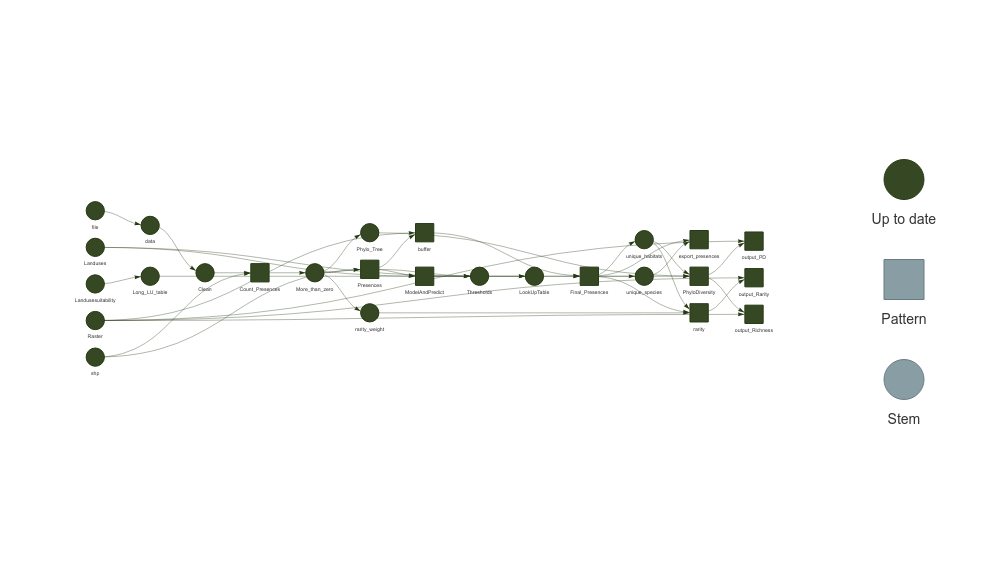

- [1 SpeciesPoolR](#1-speciespoolr)
- [2 Using SpeciesPoolR Manually](#2-using-speciespoolr-manually)
  - [2.1 Importing and Downloading Species
    Presences](#21-importing-and-downloading-species-presences)
  - [2.2 Creating Spatial Buffers and Habitat
    Filtering](#22-creating-spatial-buffers-and-habitat-filtering)
  - [2.3 Generating summary biodiversity
    statistics](#23-generating-summary-biodiversity-statistics)
- [3 Running the SpeciesPoolR
  Workflow](#3-running-the-speciespoolr-workflow)
  - [3.1 How It Works](#31-how-it-works)
- [4 References](#4-references)

<!-- README.md is generated from README.Rmd. Please edit that file -->

# 1 SpeciesPoolR

<!-- badges: start -->

[](https://github.com/derek-corcoran-barrios/SpeciesPoolR/actions/workflows/R-CMD-check.yaml)
<!-- badges: end -->

The goal of the SpeciesPoolR package is to generate potential species
pools and their summary metrics in a spatial way. You can install the
package directly from GitHub:

``` r
#install.packages("remotes")
remotes::install_github("derek-corcoran-barrios/SpeciesPoolR")
```

No you can load the package

``` r
library(SpeciesPoolR)
```

# 2 Using SpeciesPoolR Manually

## 2.1 Importing and Downloading Species Presences

### 2.1.1 Step 1: Reading and Filtering Data

If you are going to use each of the functions of the SpeciesPoolR
manually and sequentially, the first step would be to read in a species
list from either a CSV or an XLSX file. You can use the get_data
function for this. The function allows you to filter your data in a
dplyr-like style:

``` r
f <- system.file("ex/Species_List.csv", package="SpeciesPoolR")
filtered_data <- get_data(
   file = f,
   filter = quote(Kingdom == "Plantae" & 
                    Class == "Magnoliopsida" & 
                    Family == "Fabaceae")
)
```

This will generate a dataset that can be used subsequently to count
species presences and download species data as seen in table
<a href="#tab:tablespecies">2.1</a>

| redlist_2010 | Kingdom | Phyllum       | Class         | Order   | Family   | Genus     | Species               |
|:-------------|:--------|:--------------|:--------------|:--------|:---------|:----------|:----------------------|
| NA           | Plantae | Magnoliophyta | Magnoliopsida | Fabales | Fabaceae | Vicia     | Vicia sepium          |
| NA           | Plantae | Magnoliophyta | Magnoliopsida | Fabales | Fabaceae | Genista   | Genista tinctoria     |
| NA           | Plantae | Magnoliophyta | Magnoliopsida | Fabales | Fabaceae | Trifolium | Trifolium vesiculosum |
| LC           | Plantae | Magnoliophyta | Magnoliopsida | Fabales | Fabaceae | Vicia     | Vicia sativa          |
| NA           | Plantae | Magnoliophyta | Magnoliopsida | Fabales | Fabaceae | Lathyrus  | Lathyrus latifolius   |
| NA           | Plantae | Magnoliophyta | Magnoliopsida | Fabales | Fabaceae | Anthyllis | Anthyllis vulneraria  |
| NA           | Plantae | Magnoliophyta | Magnoliopsida | Fabales | Fabaceae | Vicia     | Vicia sepium          |
| NA           | Plantae | Magnoliophyta | Magnoliopsida | Fabales | Fabaceae | Lathyrus  | Lathyrus japonicus    |
| NA           | Plantae | Magnoliophyta | Magnoliopsida | Fabales | Fabaceae | Vicia     | Vicia villosa         |

<span id="tab:tablespecies"></span>Table 2.1: Species that will be used
to generate species pools

### 2.1.2 Step 2: Taxonomic Harmonization

Next, you should perform taxonomic harmonization to ensure that the
species names you use are recognized by the GBIF taxonomic backbone.
This can be done using the Clean_Taxa function:

``` r
Clean_Species <- SpeciesPoolR::Clean_Taxa(filtered_data$Species)
```

The resulting data frame, with harmonized species names, is shown in
table <a href="#tab:cleantable">2.2</a>

| Taxa                  | matched_name2         | confidence | canonicalName         | kingdom | phylum       | class         | order   | family   | genus     | species               | rank    |
|:----------------------|:----------------------|-----------:|:----------------------|:--------|:-------------|:--------------|:--------|:---------|:----------|:----------------------|:--------|
| Vicia sepium          | Vicia sepium          |         99 | Vicia sepium          | Plantae | Tracheophyta | Magnoliopsida | Fabales | Fabaceae | Vicia     | Vicia sepium          | SPECIES |
| Genista tinctoria     | Genista tinctoria     |         99 | Genista tinctoria     | Plantae | Tracheophyta | Magnoliopsida | Fabales | Fabaceae | Genista   | Genista tinctoria     | SPECIES |
| Trifolium vesiculosum | Trifolium vesiculosum |         99 | Trifolium vesiculosum | Plantae | Tracheophyta | Magnoliopsida | Fabales | Fabaceae | Trifolium | Trifolium vesiculosum | SPECIES |
| Vicia sativa          | Vicia sativa          |         97 | Vicia sativa          | Plantae | Tracheophyta | Magnoliopsida | Fabales | Fabaceae | Vicia     | Vicia sativa          | SPECIES |
| Lathyrus latifolius   | Lathyrus latifolius   |         98 | Lathyrus latifolius   | Plantae | Tracheophyta | Magnoliopsida | Fabales | Fabaceae | Lathyrus  | Lathyrus latifolius   | SPECIES |
| Anthyllis vulneraria  | Anthyllis vulneraria  |         97 | Anthyllis vulneraria  | Plantae | Tracheophyta | Magnoliopsida | Fabales | Fabaceae | Anthyllis | Anthyllis vulneraria  | SPECIES |
| Lathyrus japonicus    | Lathyrus japonicus    |         99 | Lathyrus japonicus    | Plantae | Tracheophyta | Magnoliopsida | Fabales | Fabaceae | Lathyrus  | Lathyrus japonicus    | SPECIES |
| Vicia villosa         | Vicia villosa         |         97 | Vicia villosa         | Plantae | Tracheophyta | Magnoliopsida | Fabales | Fabaceae | Vicia     | Vicia villosa         | SPECIES |

<span id="tab:cleantable"></span>Table 2.2: Taxonomicallty harmonized
dataset

### 2.1.3 Step 3: Counting Species Presences

After harmonizing the species names, it’s important to obtain the number
of occurrences of each species in your study area, especially if you
plan to calculate rarity. You can do this using the `count_presences`
function. This function allows you to filter occurrences by country or
by a shapefile. Below is an example for Denmark:

``` r
# Assuming Clean_Species is your data frame
Count_DK <- count_presences(Clean_Species, country = "DK")
```

The resulting data frame of species presences in Denmark is shown in
table <a href="#tab:tableCountDenmark">2.3</a>

``` r
knitr::kable(Count_DK, caption = "Counts of presences for the different species within Denmark")
```

| family   | genus     | species               |     N |
|:---------|:----------|:----------------------|------:|
| Fabaceae | Vicia     | Vicia sepium          |  2897 |
| Fabaceae | Genista   | Genista tinctoria     |   988 |
| Fabaceae | Trifolium | Trifolium vesiculosum |     0 |
| Fabaceae | Vicia     | Vicia sativa          | 17379 |
| Fabaceae | Lathyrus  | Lathyrus latifolius   |   684 |
| Fabaceae | Anthyllis | Anthyllis vulneraria  |  8876 |
| Fabaceae | Lathyrus  | Lathyrus japonicus    |  3904 |
| Fabaceae | Vicia     | Vicia villosa         |   243 |

<span id="tab:tableCountDenmark"></span>Table 2.3: Counts of presences
for the different species within Denmark

Alternatively, you can filter by a specific region using a shapefile.
For example, to count species presences within Aarhus commune:

``` r
shp <- system.file("ex/Aarhus.shp", package="SpeciesPoolR")

Count_Aarhus <- count_presences(Clean_Species, shapefile = shp)
```

The resulting data.frame for Aarhus commune is shown int table
<a href="#tab:tableCountAarhus">2.4</a>

| family   | genus     | species               |   N |
|:---------|:----------|:----------------------|----:|
| Fabaceae | Vicia     | Vicia sepium          | 283 |
| Fabaceae | Genista   | Genista tinctoria     |  27 |
| Fabaceae | Trifolium | Trifolium vesiculosum |   0 |
| Fabaceae | Vicia     | Vicia sativa          | 467 |
| Fabaceae | Lathyrus  | Lathyrus latifolius   |  41 |
| Fabaceae | Anthyllis | Anthyllis vulneraria  | 153 |
| Fabaceae | Lathyrus  | Lathyrus japonicus    |  39 |
| Fabaceae | Vicia     | Vicia villosa         |  10 |

<span id="tab:tableCountAarhus"></span>Table 2.4: Counts of presences
for the different species within Aarhus commune

Now it is recommended to eliminate species that have no occurrences in
the area, this is done automatically in the workflow version:

``` r
library(data.table)
Count_Aarhus <- Count_Aarhus[N > 0,]
```

So that then we can retrieve the species presences using the function
`SpeciesPoolR::get_presences`.

``` r
Presences <- get_presences(species = Count_Aarhus$species, shapefile = shp)
#> [1] "Geometry created: POLYGON ((10.401438 56.302419, 10.048024 56.355225, 9.886316 56.019928, 10.239729 55.966657, 10.401438 56.302419))"
```

there we end up with 1073 presences for our 7 species.

## 2.2 Creating Spatial Buffers and Habitat Filtering

### 2.2.1 Step 1 Creating Buffers Around Species Presences

Once you have identified the species presences within your area of
interest, the next step is to create spatial buffers around these
occurrences. These buffers represent the potential dispersal range of
each species, helping to assess areas where the species might establish
itself given a specified dispersal distance.

To create these buffers, you’ll use a raster file as a template to
rasterize the buffers and specify the distance (in meters) representing
the species’ dispersal range.

``` r
Raster <- system.file("ex/LU_Aarhus.tif", package="SpeciesPoolR")

buffer500 <- make_buffer_rasterized(Presences, file = Raster, dist = 500)
```

In this example, the make_buffer_rasterized function generates a
500-meter buffer around each occurrence point in the Presences dataset.
The function utilizes the provided raster file as a template for
rasterizing these buffers.

The resulting buffer500 data frame indicates which raster cells are
covered by the buffer for each species. Table
<a href="#tab:showbuffer500">2.5</a> displays the first 10 observations
of this data frame, providing a detailed view of the buffer’s overlap
with raster cells, listing each cell and the corresponding species
within that buffer.

| cell | species      |
|-----:|:-------------|
|   26 | Vicia sepium |
|   27 | Vicia sepium |
|   28 | Vicia sepium |
|   29 | Vicia sepium |
|   30 | Vicia sepium |
|  161 | Vicia sepium |
|  162 | Vicia sepium |
|  163 | Vicia sepium |
|  164 | Vicia sepium |
|  165 | Vicia sepium |

<span id="tab:showbuffer500"></span>Table 2.5: Raster cells within the
500-meter buffer of each species

This table provides a detailed view of how the buffer overlaps with the
raster cells, listing each cell and the corresponding species present
within that buffer.

### 2.2.2 Step 2: Habitat Filtering

After creating the buffers, the next logical step is to filter these
areas based on habitat suitability. This allows you to focus on specific
land-use types or habitats where the species is more likely to thrive.
Habitat filtering typically involves using raster data to refine or
subset the buffer areas according to the desired habitat criteria.

To achieve this, you’ll use the `ModelAndPredictFunc`, which takes the
presence data frame (e.g., Presences) obtained through the get_presences
function and the land-use raster. This comprehensive function
encompasses several critical steps:

1- *Grouping Data by Species*: The presence data is grouped by species
using `group_split`, ensuring that each species is modeled individually.

2- *Sampling Land-Use Data*: For each species, land-use data is sampled
at the presence points using the SampleLanduse function.

3- *Sampling Background Data*: Background points are also sampled from
the same land-use raster, providing a contrast to the presence data.

4- *Modeling Habitat Suitability*: The presence and background data are
combined and passed to the `ModelSpecies` function. This function fits a
MaxEnt model to predict habitat suitability across the different
land-use types.

5- *Predicting Suitability*: The fitted model is then used to predict
habitat suitability for each species across all available land-use
types.

``` r
Habitats <- ModelAndPredictFunc(DF = Presences, file = Raster)
```

The resulting Habitats data frame contains continuous suitability
predictions for each species across various land-use types. Table
<a href="#tab:tablespeciespred">2.6</a> shows the first 9 observations,
illustrating the predicted habitat suitability scores for the first
species in each land-use type.

``` r
knitr::kable(Habitats[1:9,], caption = "Predicted habitat suitability scores across various land-use types for the first species. The values represent continuous predictions, indicating the relative likelihood of species presence in each land-use category.")
```

| Landuse       |      Pred | species              |
|:--------------|----------:|:---------------------|
| OpenDryRich   | 1.0000000 | Anthyllis vulneraria |
| OpenDryPoor   | 1.0000000 | Anthyllis vulneraria |
| ForestWetRich | 0.6782673 | Anthyllis vulneraria |
| OpenWetRich   | 0.6782673 | Anthyllis vulneraria |
| OpenWetPoor   | 0.6782673 | Anthyllis vulneraria |
| Exclude       | 0.5111090 | Anthyllis vulneraria |
| ForestDryRich | 0.3633268 | Anthyllis vulneraria |
| ForestDryPoor | 0.2306091 | Anthyllis vulneraria |
| Exclude       | 0.6335459 | Genista tinctoria    |

<span id="tab:tablespeciespred"></span>Table 2.6: Predicted habitat
suitability scores across various land-use types for the first species.
The values represent continuous predictions, indicating the relative
likelihood of species presence in each land-use category.

### 2.2.3 Step 3: Generating Habitat Suitability Thresholds

While continuous predictions provide a detailed picture of habitat
suitability, it is often useful to classify these predictions into
binary suitability thresholds. Thresholds can help determine areas where
species presence is more likely or unlikely based on habitat
preferences.

The create_thresholds function facilitates this by generating thresholds
based on the modeled land-use preferences, using the 90th, 95th, and
99th percentiles of the predicted suitability values. These thresholds
represent the commission rates, helping to define the probability cutoff
above which a land-use type is considered suitable for a species.

Here’s how you can generate these thresholds for the species in your
dataset:

This step produces a data frame containing the thresholds for each
species, which can then be used to classify habitat suitability into
binary categories, helping you to identify core habitats or areas of
higher conservation value.

## 2.3 Generating summary biodiversity statistics

### 2.3.1 Step 1 Generating Phylogenetic diversity metrics

In order to generate Phylogenetic Diversity measures, the first step is
to generate a phylogenetic tree with the species we have, for that we
will use the V.Phylomaker package function `phylo.maker`based on the
megaphylogeny of vascular plants (Jin and Qian 2019; Zanne et al. 2014),
this means that we can only use this functions in species pools of
plants.

In this case we use the `generate_tree` from SpeciesPoolR to do so:

``` r
tree <- generate_tree(Count_Aarhus)
#> [1] "All species in sp.list are present on tree."
```

# 3 Running the SpeciesPoolR Workflow

If you prefer to automate the process and run the `SpeciesPoolR`
workflow as a pipeline, you can use the `run_workflow` function. This
function sets up a `targets` workflow that sequentially executes the
steps for cleaning species data, counting species presences, and
performing spatial analysis. This approach is especially useful for
larger datasets or when you want to ensure reproducibility.

To run the workflow, you can use the following code. We’ll use the same
species filter as before, focusing on the `Plantae` kingdom,
`Magnoliopsida` class, and `Fabaceae` family. Additionally, we’ll focus
on the Aarhus commune using a shapefile.

``` r
shp <- system.file("ex/Aarhus.shp", package = "SpeciesPoolR")
Raster <- system.file("ex/LU_Aarhus.tif", package="SpeciesPoolR")

run_workflow(
  file_path = system.file("ex/Species_List.csv", package = "SpeciesPoolR"),
  filter = quote(Kingdom == "Plantae" & Class == "Magnoliopsida" & Family == "Fabaceae"),
  shapefile = shp,
  dist = 500,
  rastertemp = Raster,
  rasterLU = Raster
)
#> ▶ dispatched target Raster
#> ▶ dispatched target shp
#> ● completed target shp [5.072 seconds]
#> ▶ dispatched target file
#> ● completed target file [0 seconds]
#> ▶ dispatched target data
#> ● completed target Raster [5.257 seconds]
#> ▶ dispatched target Landuses
#> ● completed target Landuses [0 seconds]
#> ● completed target data [0.418 seconds]
#> ▶ dispatched target Clean
#> ● completed target Clean [1.311 seconds]
#> ▶ dispatched branch Count_Presences_33538e94b3809372
#> ▶ dispatched branch Count_Presences_52d72a5ad405e933
#> ● completed branch Count_Presences_33538e94b3809372 [0.146 seconds]
#> ▶ dispatched branch Count_Presences_e70f77d9439a4770
#> ● completed branch Count_Presences_52d72a5ad405e933 [0.231 seconds]
#> ▶ dispatched branch Count_Presences_dea4ef8633a449a1
#> ● completed branch Count_Presences_e70f77d9439a4770 [0.075 seconds]
#> ▶ dispatched branch Count_Presences_69210fc440d13855
#> ● completed branch Count_Presences_dea4ef8633a449a1 [0.032 seconds]
#> ▶ dispatched branch Count_Presences_a61be030e01ebaf5
#> ● completed branch Count_Presences_a61be030e01ebaf5 [0.026 seconds]
#> ▶ dispatched branch Count_Presences_974105e269324d3e
#> ● completed branch Count_Presences_69210fc440d13855 [0.086 seconds]
#> ▶ dispatched branch Count_Presences_37d1f8d5f74d852c
#> ● completed branch Count_Presences_974105e269324d3e [0.03 seconds]
#> ● completed branch Count_Presences_37d1f8d5f74d852c [0.03 seconds]
#> ● completed pattern Count_Presences
#> ▶ dispatched target More_than_zero
#> ● completed target More_than_zero [0.001 seconds]
#> ▶ dispatched branch Presences_c112b37cd15959d6
#> ▶ dispatched branch Presences_af64bac105a08467
#> ● completed branch Presences_af64bac105a08467 [0.456 seconds]
#> ▶ dispatched branch ModelAndPredict_0e19b8cb545404d2
#> ● completed branch Presences_c112b37cd15959d6 [0.715 seconds]
#> ▶ dispatched branch ModelAndPredict_626a53b08dfe709d
#> ● completed branch ModelAndPredict_0e19b8cb545404d2 [1.112 seconds]
#> ▶ dispatched branch Presences_daf8d6353bc80f0c
#> ● completed branch Presences_daf8d6353bc80f0c [0.706 seconds]
#> ▶ dispatched branch ModelAndPredict_edb09c8ec5c9a988
#> ● completed branch ModelAndPredict_626a53b08dfe709d [15.273 seconds]
#> ▶ dispatched branch Presences_310adeccf6b44725
#> ● completed branch Presences_310adeccf6b44725 [0.499 seconds]
#> ▶ dispatched branch ModelAndPredict_b226446ac3154351
#> ● completed branch ModelAndPredict_b226446ac3154351 [6.467 seconds]
#> ▶ dispatched branch Presences_e65f4227e8299cc4
#> ● completed branch Presences_e65f4227e8299cc4 [0.63 seconds]
#> ▶ dispatched branch ModelAndPredict_0a8436ee3d4f2644
#> ● completed branch ModelAndPredict_edb09c8ec5c9a988 [22.417 seconds]
#> ▶ dispatched branch Presences_d4b9dc68293bd5b2
#> ● completed branch Presences_d4b9dc68293bd5b2 [0.511 seconds]
#> ▶ dispatched branch ModelAndPredict_cae8301e59fc4e01
#> ● completed branch ModelAndPredict_cae8301e59fc4e01 [0.915 seconds]
#> ▶ dispatched branch Presences_88937156c1302a12
#> ● completed branch Presences_88937156c1302a12 [0.362 seconds]
#> ● completed pattern Presences
#> ▶ dispatched branch ModelAndPredict_a0190cbfdf5f6f1f
#> ● completed branch ModelAndPredict_a0190cbfdf5f6f1f [0.312 seconds]
#> ▶ dispatched target Phylo_Tree
#> ● completed branch ModelAndPredict_0a8436ee3d4f2644 [9.433 seconds]
#> ● completed pattern ModelAndPredict
#> ▶ dispatched branch buffer_0e19b8cb545404d2
#> ● completed branch buffer_0e19b8cb545404d2 [0.071 seconds]
#> ▶ dispatched branch buffer_626a53b08dfe709d
#> ● completed branch buffer_626a53b08dfe709d [0.203 seconds]
#> ▶ dispatched branch buffer_edb09c8ec5c9a988
#> ● completed branch buffer_edb09c8ec5c9a988 [0.078 seconds]
#> ▶ dispatched branch buffer_b226446ac3154351
#> ● completed branch buffer_b226446ac3154351 [0.038 seconds]
#> ▶ dispatched branch buffer_0a8436ee3d4f2644
#> ● completed branch buffer_0a8436ee3d4f2644 [0.058 seconds]
#> ▶ dispatched branch buffer_cae8301e59fc4e01
#> ● completed branch buffer_cae8301e59fc4e01 [0.05 seconds]
#> ▶ dispatched branch buffer_a0190cbfdf5f6f1f
#> ● completed branch buffer_a0190cbfdf5f6f1f [0.112 seconds]
#> ● completed pattern buffer
#> ● completed target Phylo_Tree [36.95 seconds]
#> ▶ ended pipeline [1.229 minutes]
#> Warning message:
#> 3 targets produced warnings. Run targets::tar_meta(fields = warnings, complete_only = TRUE) for the messages.
```



## 3.1 How It Works

The run_workflow function creates a pipeline that:

1- Reads the data from the specified file path. 2- Filters the data
using the provided filter expression. 3- Cleans the species names to
match the GBIF taxonomic backbone. 4- Counts the species presences
within the specified geographic area (in this case, Aarhus). 5-
Generates a buffer around the species presences within the specified
distance, for a template raster. 6- Predicts habitat suitability for
each species across different land-use types using the
ModelAndPredictFunc, which models habitat preferences and provides
continuous predictions. 7- Generates a phyllogenetic tree for the
species in the species list. 8- Generates a visual representation of the
workflow (if plot = TRUE).

You can monitor the progress of the workflow and visualize the
dependencies between steps using targets::tar_visnetwork(). The result
will be similar to running the steps manually but with the added
benefits of parallel execution and reproducibility.

This automated approach allows you to streamline your analysis and
ensures that all steps are consistently applied to your data. It also
makes it easier to rerun the workflow with different parameters or
datasets.

# 4 References

<div id="refs" class="references csl-bib-body hanging-indent"
entry-spacing="0">

<div id="ref-Jin2019" class="csl-entry">

Jin, Yi, and Hong Qian. 2019. “V.PhyloMaker: An r Package That Can
Generate Very Large Phylogenies for Vascular Plants.” *Ecography* 42:
1353–59.

</div>

<div id="ref-Zanne2014" class="csl-entry">

Zanne, Amy E., David C. Tank, William K. Cornwell, Jonathan M. Eastman,
Stephen A. Smith, Richard G. FitzJohn, Daniel J. McGlinn, et al. 2014.
“Three Keys to the Radiation of Angiosperms into Freezing Environments.”
*American Journal of Botany* 506: 89–92.

</div>

</div>
